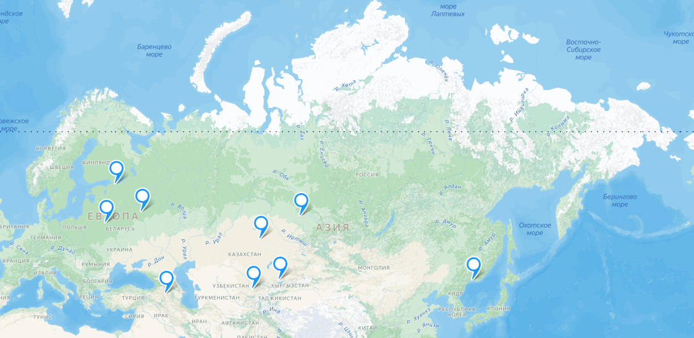

# TP_Highload_YandexEda
## 1. Тема и целевая аудитория
### Тема

Яндекс Еда - сервис заказа еды из кафе, ресторанов, продуктовых магазинов

### Целевая аудитория

 Каждый месяц Яндекс Едой пользуется 15 млн пользователей в более чем 400 городах[^1]. Количество пользователей в день нигде не раскрывается, но на основе данных к концу 2020 года - к началу 2021 с 250 тыс заказами в день и кратным ростом ежемесячной аудитории, можно сделать вывод, что кол-во ежедневных пользователей так же возросло и превысило 1 млн[^2].
 
### Аналоги

- Сбермаркет
- Самокат
- ВкусВилл
 
### Страны, в которых работает сервис

+ Россия 
+ Беларусь 
+ Казахстан 
+ Узбекистан 
+ Армения

### Ключевой функционал

- Регистрация и авторизация
- Просмотр ассортеминта ресторанов/магазинов
- Написание и чтение отзыва с оценкой
- Просмотр рейтинга с выбором источника оценок (Яндекс Еда или Яндекс Карты)
- Поиск
- Определение геопозиции клиента/курьера
- Выкладывать фото, видео и описание блюд/товаров/ресторанов

### Ключевые продуктовые решения

- Отслеживание статуса заказа и местоположения курьера в реальном времени
- Поиск объединяет товары, рестораны и блюда
- Разбиение зоны доставки на зоны с точками питания

## 2. Расчет нагрузки

- MAU - 15 млн [^1]
- DAU - 3 млн (данные, которые были взяты из предположения или примерные величины, полученные опытным путем)
- Среднее время использования приложения за день - 45 минут (учитывая составление заказа + отслеживание курьерской доставки)
- Количество заказов в день - 1 млн 
- За последний год в "Яндекс Еда" регистрировалось более 5 тысяч новых пользователей каждый день
- Коэффициент соотношения пикового трафика к среднему k= 2.3 (рассчитано на основе [^3])
- За 5 минут постоянно листая в среднем получается 500 КБ на все запросы для просмотра ленты (Примерно)
- Пользователь в среденем комментирует каждый 5ый заказ (тк значительная часть пользователей не осталвяют отзывы)

### Продуктовые метрики
#### Рассчет в штуках данных 
Личные данные: 1 запись. (в год)
История заказов: 8 (в неделю)
Платёжные данные: 1 штука. (в год)
Отзывы: 2 (в неделю)

Кол-во ресторанов - 420 [^1]
Кол-во позиций в ресторане - 73

#### Рассчет в байтах данных 

- Личные данные: 1 КБ.
- История заказов: 8 заказов по 1,5 КБ =12 КБ.
- Платёжные данные: 0,5 КБ.
- Отзывы: 2 КБ.

- Размер фото (средний) - 16 Кб
- Размер текстовой информации - 1Кб

Итого за 5 лет:
На одного пользователя:
- Личные данные: 5 записей - 5 КБ
- История заказов: 2080 - 3120 КБ
- Платёжные данные: 5 - 5КБ
- Отзывы: 520 - 520кб
- Сумма: 3650 КБ
На один ресторан(учитывая, что половина позиций меняется за год):
- Фото: 16 * 2,5 * 73 = 2920 КБ
- Текстовая информация: 185 КБ (Аналогично)
- Сумма: 3105 КБ
На всех пользователей:
15 млн * 3650 КБ = 51 ТБ
На все рестораны:
3105 КБ * 420 = 1.3 ТБ
#### Сетевой трафик
Типы трафика(приходящего):
- Запросы на получение списка ресторанов (сортировка, фильтры): каждый запрос примерно 5-10 КБ 
- Запросы на оформление заказов: каждый запрос занимает около 10-15 КБ, включая детали заказа, подтверждение и геоданные
- Запросы на оплату: порядка 5-10 КБ на каждый платёжный запрос
- Отправка push-уведомлений: 0,5-1 КБ на уведомление
Пиковое значение в течение суток (12:00 и 20:00) [^3]
200 тысяч заказов, то есть (10+15+10+1)КБ * 200 тыс = 60 Гигабит/час (примерно) = 
Также нужно учесть пользователей, которые не делают заказ или не оплатили его, это еще около:
200 тыс * 10КБ * 5КБ (нет трафика на оплату, и половина останалвивается на составлении корзины) = 81 Гигабит/час

Тогда суточное потребление составит (280 в пиковые часы + около 500 в остальное время) 780 Гигабит

#### RPS

| Действие                       | Средний RPS         | Пиковое RPS                   |
|--------------------------------|---------------------|-------------------------------|
| Запрос на получение ресторанов | 347                 | 798.1                         | 
| Запрос на получение меню       | 312                 | 717.6                         |
| Запрос на оформление заказов   | 14                  | 32.2                          | 
| Запрос на оплату               | 12                  | 27.6                          | 

## 3. Глобальная балансировка нагрузки
### Географическое расположение дата-центров

Расположение дата-центров:

На основе этих данных целесообразно расположить дата-центры в крупных городах, чтобы обеспечить минимальное время отклика для пользователей и стабильную работу сервиса.

**Россия:** Дата-центры стоит расположить в крупных городах с распределением по регионам страны:
- Москва (европейская часть России)
- Санкт-Петербург (северо-западная часть России)
- Новосибирск (сибирский регион)
- Владивосток (дальний восток)
  
**Беларусь:**
- Минск (покрытие основной части страны)

**Казахстан:**
- Астана (центр страны)
- Алматы (южная часть Казахстана)

**Узбекистан:**
- Ташкент (основной город для покрытия региона)

**Армения:**
- Ереван (главный центр для обслуживания пользователей в регионе)

#### DNS
Для балансировки трафика на уровне DNS будем использовать Latency-based DNS. Этот механизм позволяет направлять пользователей на ближайший дата-центр с минимальной задержкой (RTT), что обеспечивает высокую производительность и доступность сервиса.

#### BGP
Используем BGP Anycast для присвоения одного IP-адреса нескольким дата-центрам в пределах одной страны. Это позволяет пользователям автоматически направляться к ближайшему по расположению дата-центру, что минимизирует задержки и повышает отказоустойчивость сети.

## 4.Локальная балансировка нагрузки

В нашей схеме балансировки запросы будут поступать на балансировщик уровня L3 (сетевой уровень), который будет быстро распределять трафик между несколькими L7 балансировщиками (уровень приложений). Эти балансировщики L7 будут равномерно распределять запросы по конечным серверам, учитывая особенности запросов, такие как заголовки HTTP, куки или параметры маршрутизации.

#### L3 балансировка

L3 балансировщик распределяет трафик на основе IP-адресов, что позволяет быстро и эффективно перенаправлять запросы на нужные региональные центры обработки данных. Это минимизирует задержки и снижает нагрузку на ближайшие серверы

На сетевом уровне будем использовать Virtual Server с IP Hashing для распределения запросов. Этот метод использует хеширование IP-адреса клиента для того, чтобы направлять запросы на один и тот же сервер при повторных обращениях. Это особенно полезно для поддержания сессий и минимизации переключений между серверами.

Будем использовать Keepalived для мониторинга доступности нод. Keepalived будет следить за состоянием серверов и оповещать балансировщик в случае падения или восстановления ноды, что обеспечит отказоустойчивость системы.

#### L7 балансировка

Будем использовать балансировку с помощью Nginx в роли прокси-сервера. Nginx будет принимать входящие HTTP-запросы от клиентов и распределять их между различными серверами-бэкендами на основе URL или содержимого запросов. Таким образом, обеспечивается равномерное распределение нагрузки, оптимизация производительности и отказоустойчивость системы, что особенно важно при высоких пиковых нагрузках

## 1. Тема и целевая аудитория

### Источники

[^1]: [Что такое Яндекс Еда](https://dev.go.yandex/services/eda)
[^2]: [Битва за еду: как Delivery Club и «Яндекс.Еда» перекраивают рынок во время пандемии](https://www.forbes.ru/biznes/417203-bitva-za-edu-kak-delivery-club-i-yandekseda-perekraivayut-rynok-vo-vremya-pandemii)
[^3]: [Что заказывают в Яндекс Еде?](https://yandex.ru/company/researches/2020/food)
